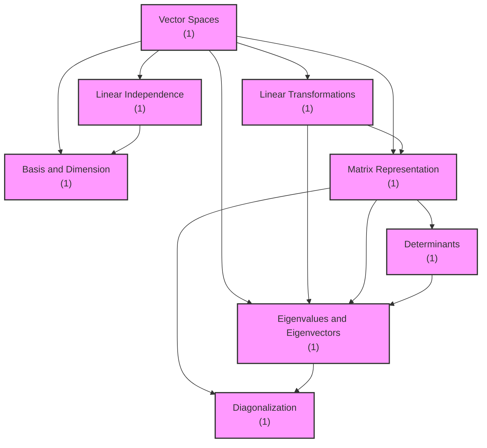

# Theory Concept Dependency Visualization

## Overview

The Concept Graph system discovers and visualizes prerequisite relationships between theory concepts in any course. It uses LLM-based prerequisite discovery to build a directed acyclic graph (DAG) showing which concepts must be learned before others.

**Key Features:**
- **Fully Generic**: Works with ANY subject (CS, Math, Physics, Chemistry, Biology, etc.)
- **No Hardcoding**: Zero hardcoded concept names or prerequisite relationships
- **Dynamic Discovery**: Uses LLM to infer prerequisites based on concept understanding
- **Multiple Visualizations**: ASCII art (CLI), Mermaid diagrams (web), JSON (API)
- **Learning Path Analysis**: Shows optimal order to learn concepts
- **Cycle Detection**: Identifies circular dependencies

## Architecture

### Core Components

1. **Concept** (`core/concept_graph.py`)
   - Represents a single theory concept
   - Fields: `id`, `name`, `description`, `exercise_count`, `prerequisites`

2. **ConceptGraph** (`core/concept_graph.py`)
   - Directed acyclic graph (DAG) of concept dependencies
   - Supports: adding concepts, adding edges, topological sort, cycle detection

3. **ConceptGraphBuilder** (`core/concept_graph.py`)
   - Builds graphs from course data
   - Extracts concepts from theory exercises
   - Uses LLM to discover prerequisites dynamically

4. **ConceptVisualizer** (`core/concept_visualizer.py`)
   - Renders graphs in multiple formats
   - ASCII art for CLI display
   - Mermaid syntax for web diagrams
   - JSON export for API consumption

## How It Works

### 1. Concept Extraction

The system extracts theory concepts from exercises with `theory_metadata`:

```python
{
    'concept_id': 'eigenvalues',
    'concept_name': 'Eigenvalues and Eigenvectors',
    'description': 'Characteristic polynomial and eigenvalues'
}
```

For exercises without metadata, it can use LLM to extract the concept from the exercise text.

### 2. Prerequisite Discovery

For each concept, the system asks the LLM:

> "Given the concept 'Diagonalization', which of these concepts are DIRECT prerequisites?"

The LLM analyzes the logical dependencies and returns concepts that must be understood first. This is **completely generic** - it works for any subject because the LLM understands conceptual relationships.

**Example Prompt:**
```
Given the concept "Eigenvalues and Eigenvectors", which of these concepts are DIRECT prerequisites (must be understood first)?

Available concepts:
- Vector Spaces
- Linear Independence
- Basis and Dimension
- Linear Transformations
- Matrix Representation
- Determinants

List ONLY the concept names that are direct prerequisites, one per line. If none, respond with "None".

Rules:
- Only list DIRECT prerequisites (not transitive)
- Concept must be logically required before understanding "Eigenvalues and Eigenvectors"
- Be conservative - only list clear dependencies
- Do not infer prerequisites not in the list

Prerequisites:
```

### 3. Graph Construction

The system builds a directed graph where:
- **Nodes** = Concepts
- **Edges** = Prerequisite relationships (A → B means "A is required before B")

### 4. Topological Sort

Using Kahn's algorithm, the system computes a valid learning order where all prerequisites are learned before dependent concepts.

### 5. Visualization

The system renders the graph in multiple formats for different use cases.

## CLI Usage

### Basic Usage

```bash
# View concept graph for a course (ASCII format)
examina concept-graph --course B006807

# Export as Mermaid diagram
examina concept-graph --course B006807 --format mermaid --export concept_graph.mmd

# Export as JSON
examina concept-graph --course B006807 --format json --export concept_graph.json

# Show learning path to specific concept
examina concept-graph --course B006807 --concept eigenvalues
```

### Options

- `--course, -c`: Course code (required)
- `--format`: Output format (`ascii`, `mermaid`, `json`)
- `--export`: Export to file
- `--concept`: Show learning path to specific concept
- `--provider`: LLM provider (`anthropic`, `openai`, `groq`, `ollama`)

## Examples

### Linear Algebra (Math)

```bash
examina concept-graph --course B006807
```

**Output:**
```
================================================================================
Concept Dependency Graph
================================================================================

--- Level 0 (Foundation - no prerequisites) ---

[1] Vector Spaces (1 exercise)
    ↓ Enables: 5 concepts


--- Level 1 (requires Level 0) ---

[2] Linear Independence (1 exercise)
    ↑ Requires: [1] Vector Spaces
    ↓ Enables: 1 concept


--- Level 2 (requires Level 1) ---

[3] Basis and Dimension (1 exercise)
    ↑ Requires: [1] Vector Spaces, [2] Linear Independence

[4] Linear Transformations (1 exercise)
    ↑ Requires: [1] Vector Spaces
    ↓ Enables: 2 concepts

[5] Matrix Representation (1 exercise)
    ↑ Requires: [1] Vector Spaces, [4] Linear Transformations
    ↓ Enables: 3 concepts


--- Level 3 (requires Level 2) ---

[6] Determinants (1 exercise)
    ↑ Requires: [5] Matrix Representation
    ↓ Enables: 1 concept


--- Level 4 (requires Level 3) ---

[7] Eigenvalues and Eigenvectors (1 exercise)
    ↑ Requires: [1] Vector Spaces, [4] Linear Transformations, [5] Matrix
Representation, [6] Determinants
    ↓ Enables: 1 concept


--- Level 5 (requires Level 4) ---

[8] Diagonalization (1 exercise)
    ↑ Requires: [5] Matrix Representation, [7] Eigenvalues and Eigenvectors

================================================================================
Total: 8 concepts, 13 dependencies
Maximum depth: 5 levels
================================================================================

Learning Order Summary:
  • Foundation concepts (start here): 1
  • Advanced concepts (require prerequisites): 7

Recommended Starting Points:
  • Vector Spaces (1 exercises)
```

### Computer Architecture (CS)

```bash
examina concept-graph --course B006802
```

The system correctly identifies relationships like:
- Boolean Algebra → Logic Gates
- Logic Gates → Combinational Circuits
- Sequential Circuits → State Machines
- CPU Architecture ↔ Instruction Set (cycle detected!)

### Learning Path

```bash
examina concept-graph --course B006807 --concept diagonalization
```

**Output:**
```
Learning Path to: Diagonalization
============================================================

You need to learn 5 concept(s) first:

1. Vector Spaces (1 exercises)
2. Linear Transformations (1 exercises)
3. Matrix Representation (1 exercises)
4. Determinants (1 exercises)
5. Eigenvalues and Eigenvectors (1 exercises)
→ Diagonalization (1 exercises) ← YOU ARE HERE

============================================================
```

## Mermaid Diagram Format

Export to Mermaid for web visualization:

```bash
examina concept-graph --course B006807 --format mermaid --export graph.mmd
```

**Output (graph.mmd):**


View at: https://mermaid.live/

## JSON API Format

Export as JSON for web applications:

```bash
examina concept-graph --course B006807 --format json --export graph.json
```

**Output Structure:**
```json
{
  "metadata": {
    "total_concepts": 8,
    "total_dependencies": 13,
    "max_depth": 5,
    "has_cycles": false
  },
  "concepts": [
    {
      "id": "vector_spaces",
      "name": "Vector Spaces",
      "description": "Vector spaces and subspaces",
      "exercise_count": 1,
      "prerequisites": [],
      "level": 0,
      "learning_order": 1
    },
    {
      "id": "eigenvalues",
      "name": "Eigenvalues and Eigenvectors",
      "description": "Characteristic polynomial and eigenvalues",
      "exercise_count": 1,
      "prerequisites": [
        "vector_spaces",
        "linear_transformations",
        "matrix_representation",
        "determinants"
      ],
      "level": 4,
      "learning_order": 7
    }
  ],
  "edges": [
    {"from": "vector_spaces", "to": "linear_independence"},
    {"from": "determinants", "to": "eigenvalues"}
  ],
  "learning_order": [
    "vector_spaces",
    "linear_independence",
    "basis_dimension",
    "linear_transformations",
    "matrix_representation",
    "determinants",
    "eigenvalues",
    "diagonalization"
  ]
}
```

## Python API

### Building a Graph

```python
from core.concept_graph import ConceptGraphBuilder
from models.llm_manager import LLMManager

# Initialize
llm = LLMManager(provider='anthropic')
builder = ConceptGraphBuilder(llm_manager=llm)

# Build graph
graph = builder.build_from_course('B006807')

# Access concepts
for concept_id, concept in graph.concepts.items():
    print(f"{concept.name}: {concept.exercise_count} exercises")

# Get prerequisites
prereqs = graph.get_prerequisites('eigenvalues')
for prereq in prereqs:
    print(f"  Requires: {prereq.name}")

# Get learning order
learning_order = graph.topological_sort()
print(f"Learn in this order: {learning_order}")
```

### Visualizing

```python
from core.concept_visualizer import ConceptVisualizer

visualizer = ConceptVisualizer()

# ASCII art
print(visualizer.render_ascii(graph))

# Mermaid diagram
mermaid_code = visualizer.render_mermaid(graph)

# JSON export
json_data = visualizer.export_json(graph)

# Learning path
path = visualizer.render_learning_path(graph, 'eigenvalues')
print(path)
```

## Generic Design Principles

### No Hardcoding

❌ **Bad (Hardcoded):**
```python
if concept_name == "Eigenvalues":
    prerequisites = ["Matrix Representation", "Determinants"]
```

✅ **Good (Dynamic):**
```python
prerequisites = self._discover_prerequisites(concept_name, all_concepts)
```

### Subject Agnostic

The system works for:
- **Math**: Linear Algebra, Calculus, Differential Equations
- **CS**: Algorithms, Data Structures, Computer Architecture
- **Physics**: Classical Mechanics, Electromagnetism, Quantum Mechanics
- **Chemistry**: Stoichiometry, Thermodynamics, Organic Chemistry
- **ANY subject** with logical concept dependencies

### LLM-Based Discovery

The LLM understands conceptual relationships across all domains:
- Math: "Eigenvalues require matrix representation and determinants"
- CS: "State machines require sequential circuits"
- Physics: "Special relativity requires classical mechanics"

This enables **zero configuration** - just provide theory exercises and the system discovers the structure.

## Cycle Detection

The system detects circular dependencies:

```
⚠ Warning: Cycles detected in dependency graph!
  Cycle: cpu_architecture → instruction_set → cpu_architecture
```

Cycles indicate either:
1. **Mutual dependence**: Concepts that must be learned together
2. **LLM error**: Incorrect prerequisite inference
3. **Domain reality**: Some concepts genuinely have circular relationships

## Integration with Learn Command

In the future, the `learn` command could show prerequisites:

```bash
examina learn --course B006807 --loop eigenvalues_computation
```

**Output:**
```
Learning: Eigenvalues Computation

Prerequisites:
  • Vector Spaces (mastered ✓)
  • Linear Transformations (mastered ✓)
  • Matrix Representation (learning...)
  • Determinants (not started)

You should learn "Determinants" before continuing with this concept.
```

## Performance

### Caching

- LLM responses are cached (file-based)
- Repeated calls use cached results
- Cache invalidation on concept changes

### Batch Processing

- Prerequisite discovery parallelizable
- Graph construction is O(V + E)
- Topological sort is O(V + E)

## Limitations

1. **Requires Theory Metadata**: Exercises must have `concept_id` and `concept_name` in `theory_metadata`
2. **LLM Accuracy**: Prerequisite discovery depends on LLM understanding
3. **Token Usage**: Each concept requires LLM call (cached after first run)
4. **Cycle Handling**: Cycles are detected but not automatically resolved

## Future Enhancements

1. **Interactive Editing**: Allow manual override of prerequisites
2. **Confidence Scores**: Show LLM confidence in each prerequisite
3. **Multi-Course Graphs**: Combine concepts across related courses
4. **Exercise Recommendations**: Suggest exercises based on current knowledge
5. **Visual Editor**: Web UI for editing and visualizing graphs
6. **Learning Analytics**: Track which prerequisites are blocking students

## Testing

Run the test suite:

```bash
# Test CS concepts
python3 scripts/test_concept_graph.py --cs

# Test Math concepts
python3 scripts/test_concept_graph.py --math

# Test all
python3 scripts/test_concept_graph.py --all
```

## Conclusion

The Concept Graph system provides **automatic, intelligent discovery of concept dependencies** without any hardcoding. It works for any subject and any course, making it a powerful tool for understanding learning prerequisites and planning study paths.

The system demonstrates that **LLMs can understand deep conceptual relationships** across all academic domains, enabling truly generic educational software.
