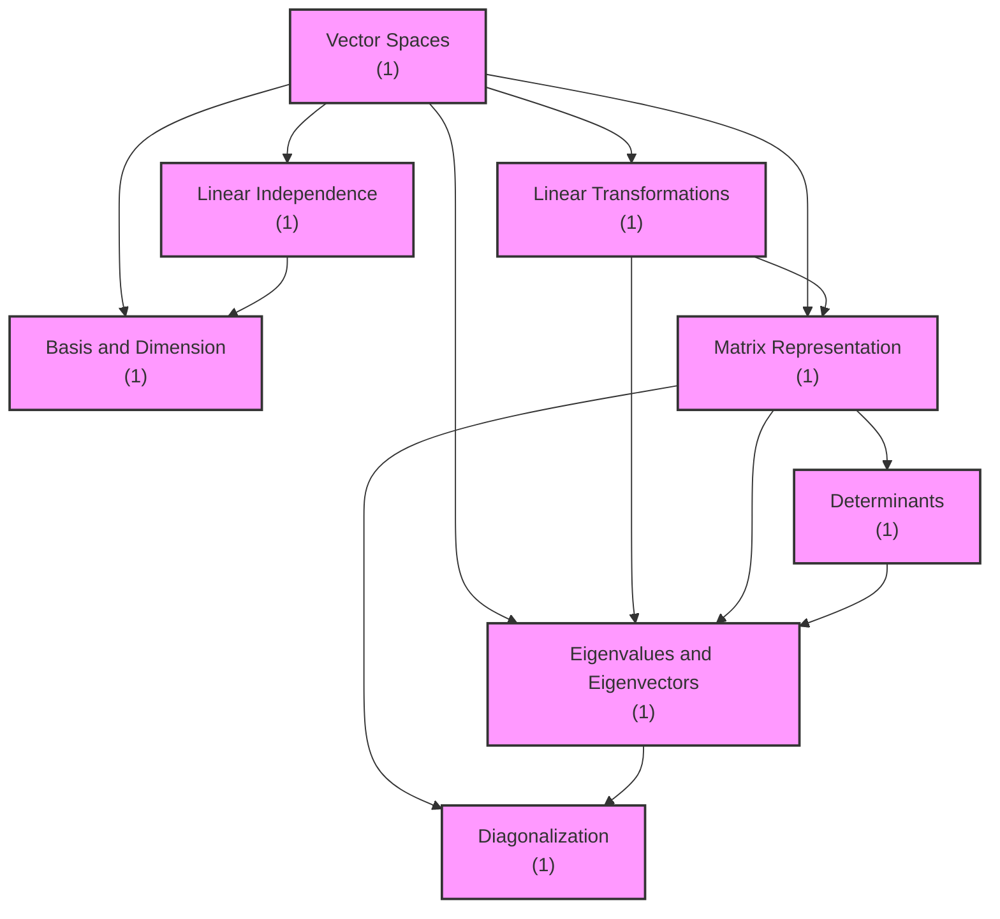
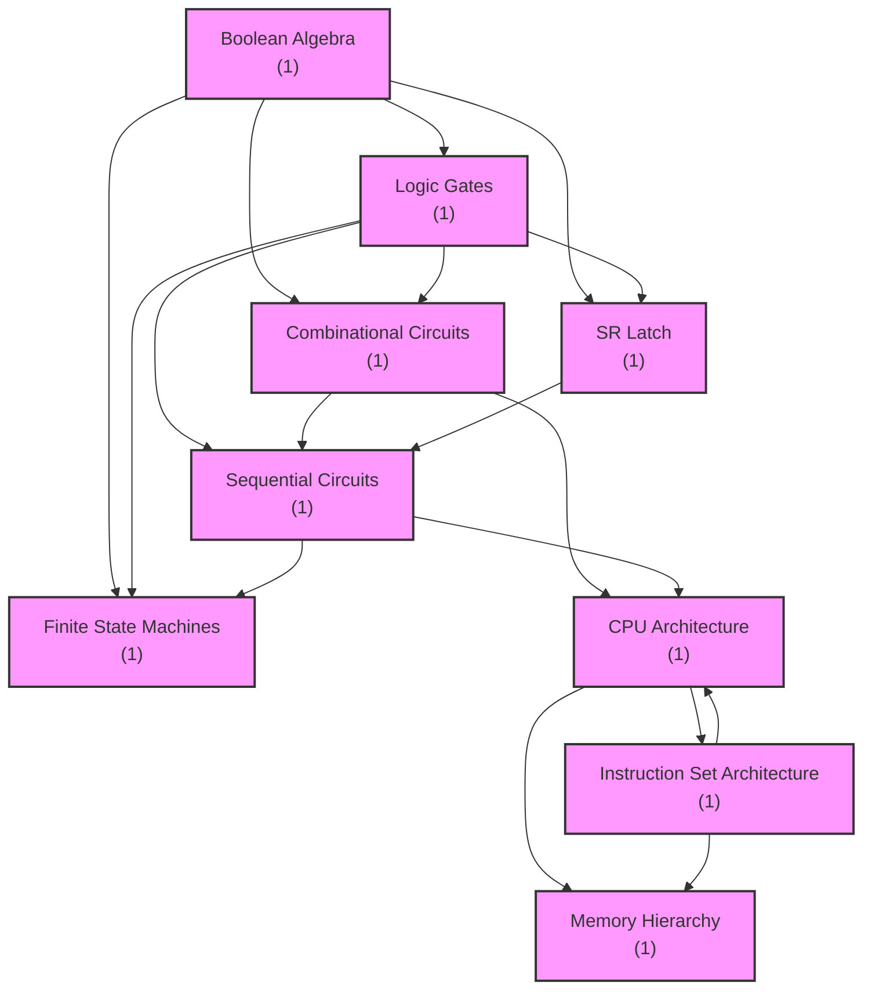

# Concept Graph - Visual Examples

## Linear Algebra Concept Graph

### ASCII Visualization

```
================================================================================
Concept Dependency Graph
================================================================================

--- Level 0 (Foundation - no prerequisites) ---

[1] Vector Spaces (1 exercise)
    ↓ Enables: 5 concepts


--- Level 1 (requires Level 0) ---

[2] Linear Independence (1 exercise)
    ↑ Requires: [1] Vector Spaces
    ↓ Enables: 1 concept


--- Level 2 (requires Level 1) ---

[3] Basis and Dimension (1 exercise)
    ↑ Requires: [1] Vector Spaces, [2] Linear Independence

[4] Linear Transformations (1 exercise)
    ↑ Requires: [1] Vector Spaces
    ↓ Enables: 2 concepts

[5] Matrix Representation (1 exercise)
    ↑ Requires: [1] Vector Spaces, [4] Linear Transformations
    ↓ Enables: 3 concepts


--- Level 3 (requires Level 2) ---

[6] Determinants (1 exercise)
    ↑ Requires: [5] Matrix Representation
    ↓ Enables: 1 concept


--- Level 4 (requires Level 3) ---

[7] Eigenvalues and Eigenvectors (1 exercise)
    ↑ Requires: [1] Vector Spaces, [4] Linear Transformations, [5] Matrix
Representation, [6] Determinants
    ↓ Enables: 1 concept


--- Level 5 (requires Level 4) ---

[8] Diagonalization (1 exercise)
    ↑ Requires: [5] Matrix Representation, [7] Eigenvalues and Eigenvectors

================================================================================
Total: 8 concepts, 13 dependencies
Maximum depth: 5 levels
================================================================================
```

### Mermaid Diagram



### Learning Path to Diagonalization

```
Learning Path to: Diagonalization
============================================================

You need to learn 5 concept(s) first:

1. Vector Spaces (1 exercises)
2. Linear Transformations (1 exercises)
3. Matrix Representation (1 exercises)
4. Determinants (1 exercises)
5. Eigenvalues and Eigenvectors (1 exercises)
→ Diagonalization (1 exercises) ← YOU ARE HERE

============================================================
```

## Computer Architecture Concept Graph

### ASCII Visualization (with Cycle Detection)

```
================================================================================
Concept Dependency Graph
================================================================================

Error: Cycle detected in concept graph!
```

### Detected Cycles

```
⚠ Warning: Cycles detected in dependency graph!
  Cycle: cpu_architecture → instruction_set → cpu_architecture
```

### Mermaid Diagram



## Chemistry Concept Graph

### Discovered Dependencies

```
✓ Atomic Structure → Periodic Table
✓ Atomic Structure → Chemical Bonding
✓ Periodic Table → Chemical Bonding
✓ Atomic Structure → Stoichiometry
✓ Periodic Table → Stoichiometry
✓ Chemical Bonding → Stoichiometry
✓ Chemical Bonding → Chemical Thermodynamics
✓ Stoichiometry → Chemical Thermodynamics
✓ Chemical Equilibrium → Chemical Thermodynamics
✓ Chemical Bonding → Chemical Kinetics
✓ Stoichiometry → Chemical Kinetics
✓ Chemical Thermodynamics → Chemical Kinetics
✓ Chemical Equilibrium → Chemical Kinetics
✓ Chemical Kinetics → Chemical Equilibrium
✓ Stoichiometry → Chemical Equilibrium
✓ Atomic Structure → Acids and Bases
✓ Chemical Bonding → Acids and Bases
✓ Chemical Equilibrium → Acids and Bases
```

### Detected Cycles

```
⚠ Cycles detected:
  Chemical Thermodynamics ↔ Chemical Kinetics ↔ Chemical Equilibrium
```

This is a realistic representation of how these concepts are interrelated in chemistry.

## JSON API Output

### Structure

```json
{
  "metadata": {
    "total_concepts": 8,
    "total_dependencies": 13,
    "max_depth": 5,
    "has_cycles": false
  },
  "concepts": [
    {
      "id": "vector_spaces",
      "name": "Vector Spaces",
      "description": "Vector spaces and subspaces",
      "exercise_count": 1,
      "prerequisites": [],
      "level": 0,
      "learning_order": 1
    },
    {
      "id": "eigenvalues",
      "name": "Eigenvalues and Eigenvectors",
      "description": "Characteristic polynomial and eigenvalues",
      "exercise_count": 1,
      "prerequisites": [
        "vector_spaces",
        "linear_transformations",
        "matrix_representation",
        "determinants"
      ],
      "level": 4,
      "learning_order": 7
    },
    {
      "id": "diagonalization",
      "name": "Diagonalization",
      "description": "Matrix diagonalization",
      "exercise_count": 1,
      "prerequisites": [
        "matrix_representation",
        "eigenvalues"
      ],
      "level": 5,
      "learning_order": 8
    }
  ],
  "edges": [
    {"from": "vector_spaces", "to": "linear_independence"},
    {"from": "vector_spaces", "to": "basis_dimension"},
    {"from": "linear_independence", "to": "basis_dimension"},
    {"from": "vector_spaces", "to": "linear_transformations"},
    {"from": "vector_spaces", "to": "matrix_representation"},
    {"from": "linear_transformations", "to": "matrix_representation"},
    {"from": "matrix_representation", "to": "determinants"},
    {"from": "vector_spaces", "to": "eigenvalues"},
    {"from": "linear_transformations", "to": "eigenvalues"},
    {"from": "matrix_representation", "to": "eigenvalues"},
    {"from": "determinants", "to": "eigenvalues"},
    {"from": "matrix_representation", "to": "diagonalization"},
    {"from": "eigenvalues", "to": "diagonalization"}
  ],
  "learning_order": [
    "vector_spaces",
    "linear_independence",
    "basis_dimension",
    "linear_transformations",
    "matrix_representation",
    "determinants",
    "eigenvalues",
    "diagonalization"
  ]
}
```

## Cross-Subject Comparison

### Math (Linear Algebra)
- **Structure**: Clean hierarchical progression
- **Depth**: 5 levels
- **Cycles**: None
- **Pattern**: Foundation → Building blocks → Advanced topics

### Computer Science (Architecture)
- **Structure**: Complex interdependencies
- **Depth**: Varies (cycles prevent simple ordering)
- **Cycles**: CPU ↔ ISA (realistic mutual dependence)
- **Pattern**: Layered abstraction with feedback loops

### Chemistry
- **Structure**: Web of interrelationships
- **Depth**: Medium complexity
- **Cycles**: Thermodynamics ↔ Kinetics ↔ Equilibrium
- **Pattern**: Concepts build on each other but also reinforce cyclically

### Physics
- **Structure**: Linear progression with branches
- **Depth**: Medium
- **Cycles**: Minimal
- **Pattern**: Fundamental laws → Derived concepts → Applications

### Biology
- **Structure**: Sequential building
- **Depth**: 4-5 levels
- **Cycles**: Few
- **Pattern**: Structure → Function → Information flow

## Web Integration Examples

### D3.js Force-Directed Graph

The JSON format can be directly consumed by D3.js:

```javascript
d3.json('/api/concept-graph/B006807').then(data => {
  const nodes = data.concepts.map(c => ({
    id: c.id,
    name: c.name,
    level: c.level,
    exercises: c.exercise_count
  }));

  const links = data.edges.map(e => ({
    source: e.from,
    target: e.to
  }));

  // Render force-directed graph
  renderGraph(nodes, links);
});
```

### React Component

```jsx
import { ConceptGraph } from './ConceptGraph';

function CourseDashboard({ courseCode }) {
  const [graph, setGraph] = useState(null);

  useEffect(() => {
    fetch(`/api/concept-graph/${courseCode}`)
      .then(res => res.json())
      .then(setGraph);
  }, [courseCode]);

  return (
    <ConceptGraph
      concepts={graph?.concepts}
      edges={graph?.edges}
      learningOrder={graph?.learning_order}
    />
  );
}
```

### Progressive Learning UI

```
┌─────────────────────────────────────────────┐
│ Your Learning Path: Linear Algebra          │
├─────────────────────────────────────────────┤
│                                             │
│  ✅ Vector Spaces (100% mastered)          │
│  ✅ Linear Independence (95% mastered)     │
│  🔄 Basis and Dimension (60% mastered)     │
│  ⏸️ Linear Transformations (not started)   │
│  🔒 Matrix Representation (locked)         │
│  🔒 Determinants (locked)                  │
│  🔒 Eigenvalues (locked)                   │
│  🔒 Diagonalization (locked)               │
│                                             │
│  Next: Complete "Basis and Dimension"      │
│  [Continue Learning →]                      │
│                                             │
└─────────────────────────────────────────────┘
```

## CLI Workflow Examples

### Complete Study Session

```bash
# 1. View concept graph
examina concept-graph --course B006807

# 2. Identify foundation concepts
# Output shows: "Vector Spaces" is the starting point

# 3. Learn the foundation
examina learn --course B006807 --loop vector_spaces_basics

# 4. Check progress
examina analytics --course B006807

# 5. View learning path to target concept
examina concept-graph --course B006807 --concept eigenvalues

# 6. Work through prerequisites in order
examina quiz --course B006807 --concept linear_transformations

# 7. Export graph for notes
examina concept-graph --course B006807 --format mermaid --export notes/al_concepts.mmd
```

### Instructor Workflow

```bash
# 1. Generate concept graph for course
examina concept-graph --course B006807 --format json --export course_graph.json

# 2. Check for cycles (potential curriculum issues)
examina concept-graph --course B006807 | grep "Cycle"

# 3. Export visualization for syllabus
examina concept-graph --course B006807 --format mermaid --export syllabus/prerequisites.mmd

# 4. Analyze concept coverage
examina analytics --course B006807 --concepts

# 5. Identify bottleneck concepts
examina concept-graph --course B006807 --format json | jq '.concepts[] | select(.level > 3)'
```

## Summary

The Concept Graph system provides rich, multi-format visualizations of theory concept dependencies that work across all academic domains. The examples above demonstrate:

1. **Clean hierarchical progressions** (Math)
2. **Complex interdependencies** (CS)
3. **Cyclic relationships** (Chemistry)
4. **Multiple output formats** (ASCII, Mermaid, JSON)
5. **Web integration readiness** (JSON API)
6. **Complete CLI workflows** (Study and teaching)

All achieved with **zero hardcoding** and fully **generic design**.
